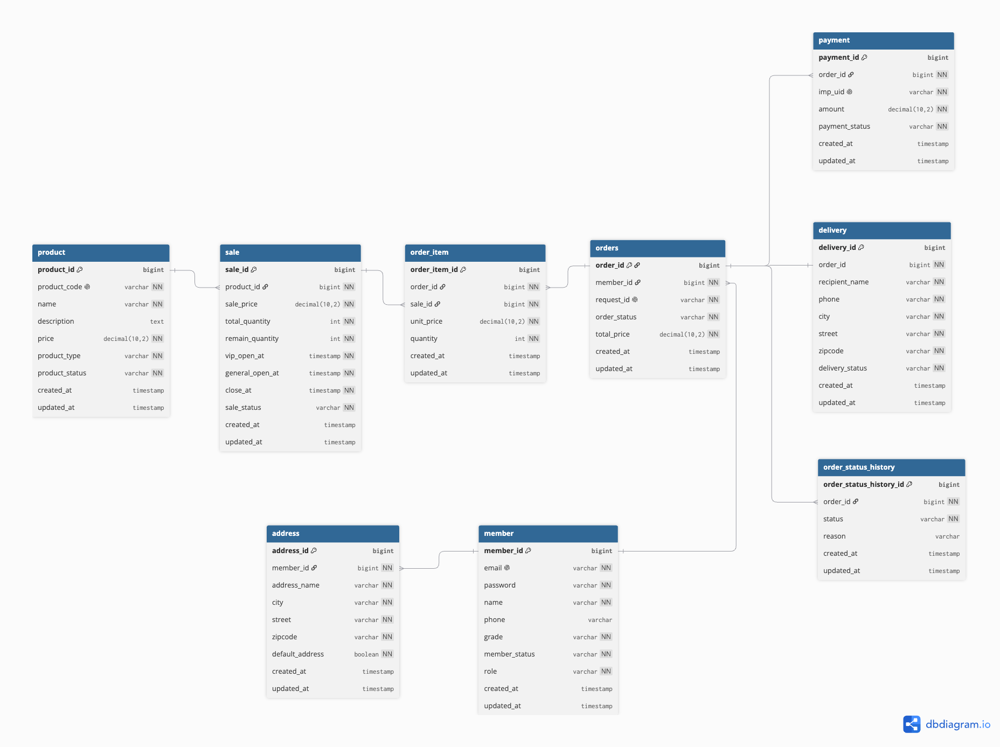

# Limited Market
Java 17 · Spring Boot · MySQL · Redis

한정 수량 상품의 동시 주문 환경에서 **데이터 정합성**과 **처리량**을 함께 고려한 선착순 주문 API입니다.

---


## ✨ 핵심 기능

| 기능    | 설명                           |
| ----- | ---------------------------- |
| 회원 인증 | JWT 기반 로그인                   |
| 상품 판매 | 회원 등급별 판매 시작 시간 적용           |
| 주문 관리 | 주문 · 결제 · 취소 처리         |
| 재고 관리 | Redis 선차감 + MySQL 재고 관리      |
| 토큰 관리 | Redis 기반 Refresh Token 저장    |
| 배포    | Docker, Nginx, AWS EC2 기반 배포 환경 구성 |

---

## 🛠 Tech Stack

| 구분       | 기술                                    |
| -------- | ------------------------------------- |
| Backend  | Java 17, Spring Boot, Spring Data JPA, Spring Security |
| Database | MySQL, Redis                          |
| Infra    | Docker Compose, Nginx, AWS EC2                |
| Test     | JUnit 5, JMeter                        |

---

## 🏗 시스템 구조

### Architecture


### ERD



---

## 🔍 핵심 구현

- **선착순 주문 동시성 제어**
  - 낙관적 락, 비관적 락, Redis 선차감을 비교하고 최종적으로 Redis `DECRBY`와 MySQL 비관적 락을 조합
  - Redis에서 품절 요청을 DB 진입 전에 차단하고, MySQL 비관적 락으로 최종 재고 정합성 확보
  - 재고 100개 대상 10,000건 집중 요청에서 정확히 100건 처리, 초과 판매 0건 유지
  - 비관적 락 단독 대비 TPS 최대 42% 개선, 평균 응답 시간 35% 단축
- **Redis와 DB 정합성 관리**
  - MySQL을 기준 데이터로 유지하고 Redis를 품절 요청 차단을 위한 재고 캐시로 사용
  - Redis 재고 선차감 후 MySQL 주문 트랜잭션이 실패하면 차감한 수량을 즉시 복구
  - 주문 취소 시 `@TransactionalEventListener(AFTER_COMMIT)`를 적용해 DB 커밋 이후 Redis 재고 복구
  - 애플리케이션 시작 시 판매 예정·진행 중인 항목을 조회하고, Redis 재고 키가 없는 경우에만 MySQL의 남은 재고를 기준으로 초기화
- **Docker 기반 배포 환경 구성과 장애 대응**
  - Spring Boot, MySQL, Redis, Nginx를 Docker Compose로 구성
  - 외부에는 Nginx의 80 포트만 노출하고 애플리케이션·DB·Redis는 내부 네트워크로 격리
  - RAM 2GB EC2에서 두 프로젝트의 컨테이너를 함께 실행하며 발생한 메모리 부족 원인을 분석
  - EBS를 8GB에서 20GB로 확장하고 Swap을 구성해 서비스를 복구

> 자세한 설계 과정과 성능 비교는 포트폴리오에서 확인할 수 있습니다.

---

## 🚀 실행 방법

### 1. 프로젝트 다운로드

```bash
git clone https://github.com/HaheeBahee/limited-market.git
cd limited-market
```

### 2. 환경변수 설정

```bash
cp .env.example .env
```

`.env` 파일에 필요한 환경변수를 입력합니다.

### 3. 애플리케이션 빌드

```bash
./gradlew clean bootJar
```

### 4. Docker 컨테이너 실행

```bash
docker compose up -d --build
```

### 5. 실행 확인

```bash
docker compose ps
```

### 테스트 실행

```bash
docker compose -f docker-compose.yml -f docker-compose.local.yml up -d mysql redis
./gradlew test
```
---

## 📄 API 문서

### Local

http://localhost:8080/swagger-ui/index.html

### Deployment

http://13.124.129.7/swagger-ui/index.html

> 개인 AWS EC2 환경에서 운영 중입니다.
> 서버 상태에 따라 일시적으로 접속이 제한될 수 있습니다.

---

## 📂 프로젝트 구조
```text
src
 ├── main
 │   └── java/com/limitedmarket/api
 │       ├── domain
 │       │   ├── auth        # 인증, 토큰 재발급
 │       │   ├── member      # 회원, 등급
 │       │   ├── product     # 상품
 │       │   ├── sale        # 판매 오픈, 재고
 │       │   ├── order       # 주문, 취소
 │       │   ├── payment     # 결제
 │       │   ├── delivery    # 배송
 │       │   └── address     # 배송지
 │       │
 │       └── global
 │           ├── config      # Security, Swagger 설정
 │           ├── jwt         # JWT 발급, 검증, 필터
 │           ├── redis       # Redis 설정, 재고 초기화
 │           ├── security    # 인증 객체
 │           ├── exception   # 예외 처리
 │           └── response    # 공통 응답
 │
 └── test
     └── domain
         └── order           # 주문 생성, 취소 테스트
```
